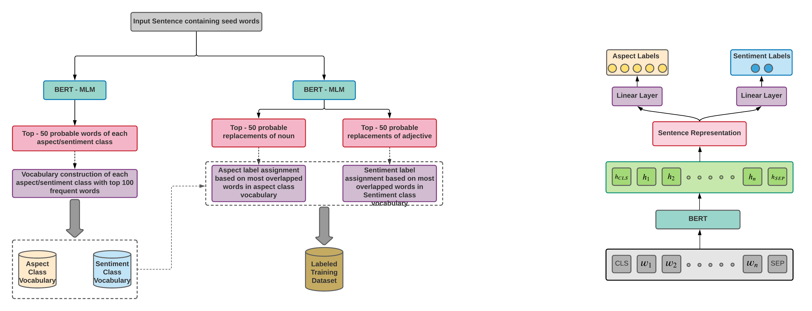

# UnsupervisedABSA
We propose a BERT based three-step mixed semi-supervised model, which jointly detects aspect and sentiment in a given review sentence. The first step takes a small set of seed words for each aspect and each sentiment class to construct class vocabulary for each class using a context-aware BERT masked language model. The second step extracts aspect/opinion term(s) using POS tags and constructed vocabularies in step one. In the last step, extracted aspect and opinion words are used as label data to train a BERT based joint deep neural network for aspect and sentiment classification.

## CASC
In this work, we leverage power of post-trained, domain knowledge BERT (DK-BERT) and present a simple and highly efficient semi-supervised hybrid CASC approach for Context aware Aspect category and Sentiment Classification. Our model is built in a simple three-step process: 
1. We take a small set of seed words for each aspect and each sentiment class and then construct class vocabulary for each class that contains semantically coherent words with the seed words using BERT masked language model (MLM).
2. We take unlabeled training corpus and extract potential aspects and opinion terms using POS tags and class vocabularies constructed in the previous step.
3. In the last step, We make use of extracted aspect and opinion term as label data and jointly train BERT based neural model for aspect and sentiment classification.



### Requirements

To install all dependencies:
```bash
pip install -r requirements.txt
```

### Quick start
Run command:
```bash
python main.py
```

### Datasets
Prepared datasets for both `laptop` and `restaurant` domain are available under `datasets/` directory, acquired from [Huang et al.](https://github.com/teapot123/JASen).

### Configuration
All configuration and model hyperparameters can be found at `config.py`.

**Configuring Domain**
```python
config = {
    'domain': 'laptop',
    'device': 'cpu'
}
```
The `domain` attribute determines which *domain* is used for training the model, which can be set to `laptop` or `restaurant`. Moreover, `device` can be set to `cuda` for training model on GPU.

**Configuring data path**
```python
path_mapper = {
    'laptop': './datasets/laptop',
    'restaurant': './datasets/restaurant'
}
```
The `path_mapper` is responsible for providing root directory paths for each domain. The root directory should contain 2 files namely, `train.txt` (consisting of line separated reviews from the corpus) and `test.txt` (with `serial number`, `aspect category`, `sentiment category` and `review sentence` separated by tabs for each test example).

**Providing seed words**
`aspect_seed_mapper` and `sentiment_seed_mapper` are used for providing seed words for aspect and sentiment classes for each domain.

**Aspect seeds**
```python
aspect_seed_mapper = {
    'laptop': {
        'support': {"support", "service", "warranty", "coverage", "replace"},
        'os': {"os", "windows", "ios", "mac", "system", "linux"},
        'display': {"display", "screen", "led", "monitor", "resolution"},
        'battery': {"battery", "life", "charge", "last", "power"},
        'company': {"company", "product", "hp", "toshiba", "dell", "apple", "lenovo"},
        'mouse': {"mouse", "touch", "track", "button", "pad"},
        'software': {"software", "programs", "applications", "itunes", "photo"},
        'keyboard': {"keyboard", "key", "space", "type", "keys"}
    },
    'restaurant': {
        'food': {"food", "spicy", "sushi", "pizza", "taste", "delicious", "bland", "drinks", "flavourful"},
        'place': {"ambience", "atmosphere", "seating", "surroundings", "environment", "location", "decoration", "spacious", "comfortable", "place"},
        'service': {"tips", "manager", "waitress", "rude", "forgetful", "host", "server", "service", "quick", "staff"}
    }
}
```

**Sentiment seeds**
```python
sentiment_seed_mapper = {
    'laptop': {
        'positive': {"good", "great", 'nice', "excellent", "perfect", "impressed", "best", "thin", "cheap", "fast"},
        'negative': {"bad", "disappointed", "terrible", "horrible", "small", "slow", "broken", "complaint", "malware", "virus", "junk", "crap", "cramped", "cramp"}
    },
    'restaurant': {
        'positive': {"good", "great", 'nice', "excellent", "perfect", "fresh", "warm", "friendly", "delicious", "fast", "quick", "clean"},
        'negative': {"bad", "terrible", "horrible", "tasteless", "awful", "smelled", "unorganized", "gross", "disappointment", "spoiled", "vomit", "cold", "slow", "dirty", "rotten", "ugly"}
    }
}
```
